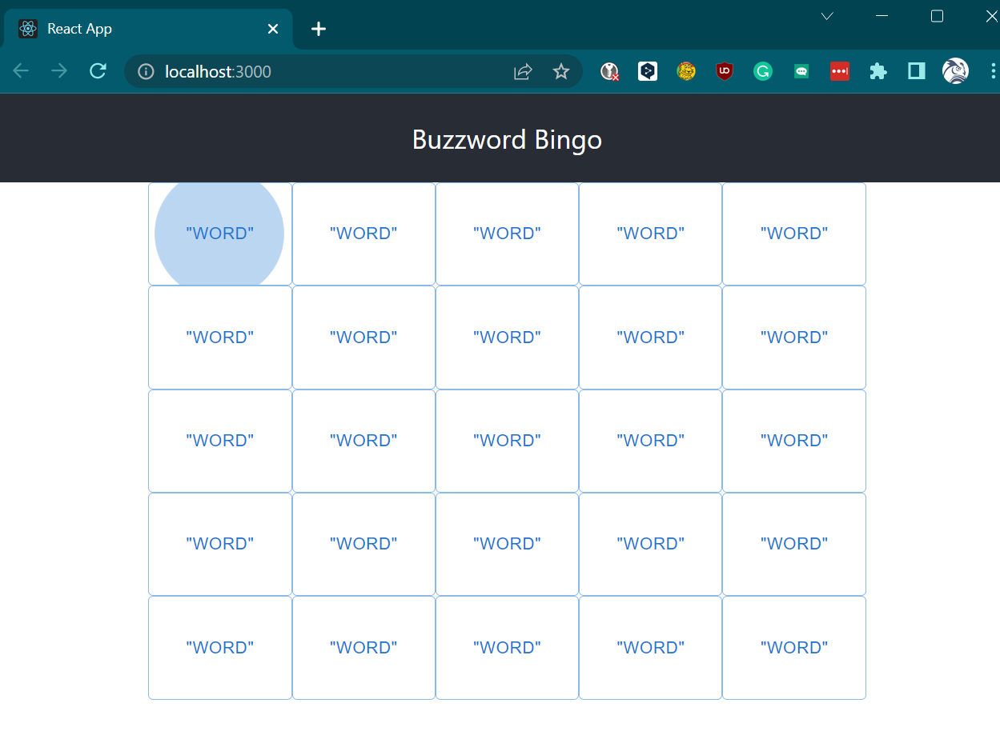

# 🎲 Buzzword Bingo Coding Challenge 🎲

Welcome at _azeti_, and thank you very much for taking the time to participate in this
challenge!

In this repository, you will find the boilerplate code for a game. Your task is the completion of the code into a
playable game.

We'll explain the game rules a bit below after some words of introduction.

## Logistics and Expectations

We know that you'd be using your precious free time to work on this challenge
and therefore, we want to set clear expectations to ensure that your time is
spent reasonably, and to avoid that, you waste or invest too much of it.
Again we appreciate your participation.

__How much time should I spend❓__

A reasonable amount of time is a couple of hours, if you are aware of the
technologies, we guess you would be able to complete this in less than
2 hours.

__How do we evaluate the results❓__

We will not grade or evaluate based on quantity but on quality. Apart from
implementing the asked stuff, feel free to add any comments or remarks that
you may find relevant.

__How can I submit my results❓__

First, copy this repository to your GitHub, GitLab, Bitbucket, or any other
git repository. Secondly, commit your code to it and share the link to your
repository with us. Make sure we can read your repository. We will then review your code.

__How much time do I have to complete this challenge❓__

You will have a maximum of _1 week_ after receiving this challenge.
Again, take the quality into consideration, don't rush!

## Buzzword Bingo Game Rules

We first describe the game from the user's point of view.

Buzzword Bingo shall be played by two or more players participating in the same meeting.

The playing surface consists of 5 by 5 squares. All squares are filled with a word at the beginning of the game. No word appears twice on the board. All squares have white color. All players run their own version of the app therefore each player will see a different board setup.

The player now attentively participates in a meeting. Whenever he hears a word that appears on his playing field, he clicks on this square. The corresponding field changes its colour to blue.

As soon as one player has clicked all the squares in a column, in a row or in one of the two main diagonals, the colour of the squares concerned changes to green.

In this case, the player shall shout "Bingo" loudly into the meeting. He's the winner of the current round and the game ends here.

## How to implement the game?

### The Boilerplate code

We have already created a basic framework. This boilerplate code was created using

    npx create-react-app buzzword-bingo-coding-challenge-fe

    npm install @mui/material @emotion/react @emotion/styled

More information about the used frameworks can be found here:

https://create-react-app.dev/
https://mui.com/material-ui/getting-started/overview/

After checking out the code from the repo you can compile and run it like this:

    npm install

    npm run

your browser should start up. If not, please goto

    localhost:3000

You should then see a basic playground like this:

The code reacts to click events. Each square will change the color from
white to blue. But not more.

### What should you do?

Your mission is the extension of the boilerplate code in a way that the game gets
playable according to the given rules above.

You're free to change the boilerplate code to your needs!

⚠️ Please keep in mind that the code already contains a dictionary in the file `Dictionary.js` which is not yet referenced.

### Here are our acceptance criteria:

* You should stick to the given base framework of Javascript, React and Material-UI. Optional: Switch to Typescript.

* The game must compile without errors and fully playable.

* The given word list shall be used.

* You should add a button that can restart the game at any given time.

* When the game is over, the buttons shall be no longer clickable.

### Additional remarks

* Please document if extra knowledge is required to compile and start your code.

* Comment if you think it's strictly required. Commenting trivial stuff will not earn you more points.

* We recommend to add one or two screenshots of your final version into the repo. 

Don't hesitate to contact us in case of any questions or remarks!

_Have fun!_
