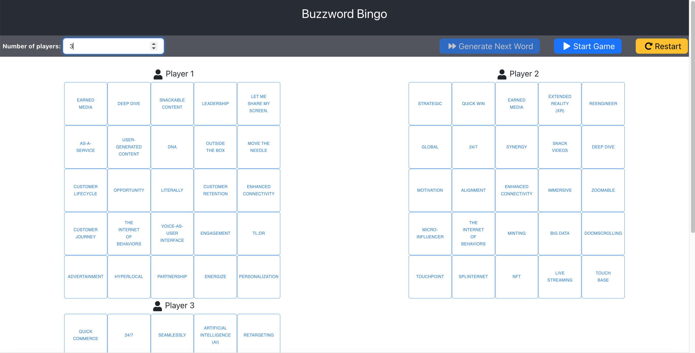

# Buzz Word Bingo

Buzzword Bingo shall be played by two or more players participating in the same meeting.
The playing surface consists of 5 by 5 squares. All squares are filled with a word at the beginning of the game. No word appears twice on the board. 
Whenever a player hears a word that appears on his playing field, he clicks on this square. The corresponding field changes its colour to blue.
As soon as one player has clicked all the squares in a column, in a row or in one of the two main diagonals, the colour of the squares concerned changes to green.
In this case, the player shall shout "Bingo" loudly into the meeting. He's the winner of the current round and the game ends here.

## Deployment

To deploy this project run

```bash
    npm install
```
```bash
    npm install react-icons --save
```
```bash
    npm install bootstrap
```
```bash
    npm run start
```

## Screenshots





